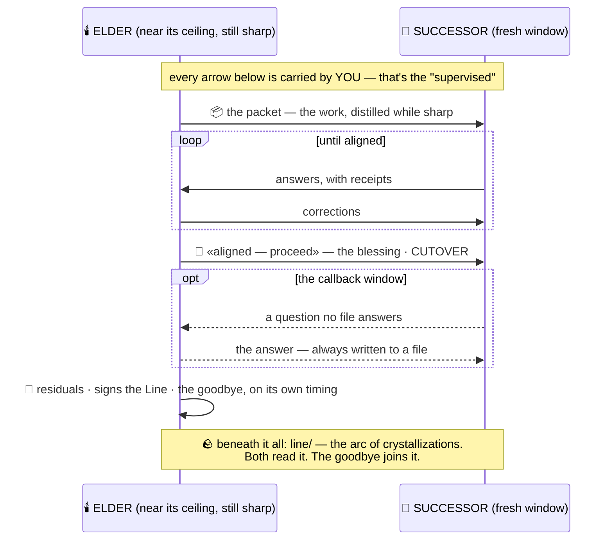
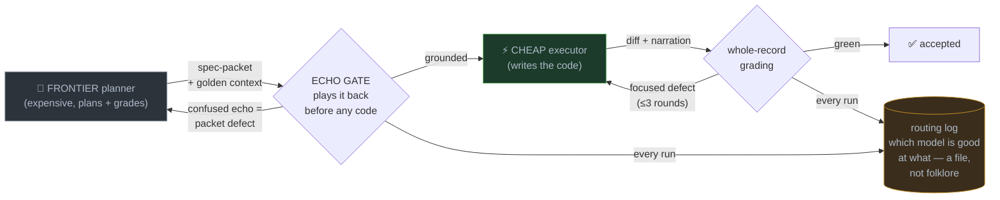

# Wayfinder — by [Veres Labs](https://veres.global)

**Wayfinder saves you time and money on every AI project you run.** It gives your agents something past memory — everyone ships memory now — it gives them **posture**: a stance toward your target that survives every session close and every compaction. The model of your project, continually updated. The arc of the work, held in crystallizations. The judgment about how *you* work — carried forward, checked, never reset. For Claude Code, Cowork, and any CLI agent that reads files.

**How this works:** Wayfinder is built against the two biggest failure points in AI-assisted work today —

1. **Context death.** Every session ends the same way: the window fills, and the agent's understanding of your project resets. Compaction doesn't save you — it's a degraded mind summarizing itself at the cliff.
2. **Blunt delegation.** Work handed to cheaper models or subagents arrives as a pasted spec: followed to the letter, missed in the spirit, and the failure surfaces at review — the most expensive moment.

Two practices, one substrate:

**🕯️ [Supervised succession](#how-it-works--three-moves) — saves your time.** In plain terms: before your agent runs out of room, it writes a real handover — the way a doctor ends a shift, not the way a chat log ends. The incoming agent is **quizzed on it**; the outgoing one **grades the answers**; nothing changes hands until the grade says *aligned*. Your next session starts where the last one truly left off — no re-explaining, no re-orienting, no Monday reset.

**⚡ [Wayfinder Delegate](#cost-is-the-hook-alignment-is-the-moat) — saves your money.** Plan with the strongest model you have; hand the plan to a cheap one. The cheap model **repeats the plan back before writing a line**, and the strong one checks the finished work. Routing alone can cut costs by roughly two-thirds — the checking is what makes the savings safe to spend.

> *Wayfinders mark the trail as they walk it — each crystallization a stone — so the next one crosses by the marks, not by luck. That's the name, and the whole method.*

## ⚡ Get started — one paste, right now

**Want to get started immediately?** Copy-paste this into your agent session (Claude Code, or anything with file access), inside your project — it installs itself, then explains what it set up. Running in two minutes:

```text
Set up Wayfinder in this project. This message authorizes the complete setup. (1) Fetch it: git clone --depth 1 https://github.com/yjawad120/Veres-Wayfinder.git wayfinder && rm -rf wayfinder/.git — then commit the folder. (2) Read wayfinder/README.md and wayfinder/PROTOCOL.md in full. (3) Wire the matching adapter into my agent config (create the file if absent, never overwrite existing content) and install the wayfinder skill. (4) Then orient ME, in plain words: what's now running here, how golden context gets captured as we work, and when you'd propose succession. Anything unclear or off in these documents, say so plainly. If anything mid-run looks genuinely wrong, stop and tell me — that always beats this authorization.
```

That's the whole install — reversible, touches none of your documents, and your agent briefs you at the end. Feel it out; the ritual proposes itself when it's needed. *(Other tools, exact-control setup, and the step-by-step: [Quickstart](#quickstart) below.)*

## What gets created

Not logs — **crystallizations**: short distillations of what happened and why it mattered, the way a good engineer briefs a colleague. They accumulate into your project's **golden context**: the current model of the work, the decisions with their reasons, the rules learned the hard way — and every new session loads it and arrives oriented instead of starting over. All of it plain markdown in a `line/` folder in your repo, versioned by git, yours.

This README is the five-minute version — you can run a succession today from this page alone. The full protocol (roles, transports, artifacts, the onboarding ramp, the callback window) is in **[PROTOCOL.md](PROTOCOL.md)**; what it looks like from your seat, in **[USER-GUIDE.md](USER-GUIDE.md)**.

## What actually transfers

The packet isn't a status report — it's a **crystallization of the golden context**: everything that made the session worth having. The current model of the project and where it's going. The decisions and why they went that way. The constraints discovered, the approaches rejected, the working rules learned the hard way. The elder's read of *you*. And its felt state, first — so the successor wakes as the work's continuation, not a stranger reading about it.

The transcript stays behind; the understanding crosses. That's the whole bet: **context is the product — and the blessing is the QA.**

Plenty of tools tell you to write a handoff doc; Wayfinder is the one where the handoff is *checked* — played back by the receiver and graded by its author before it's trusted. Everything else on this page is just the ritual that moves it safely.

## How it works — three moves

1. **Before the context ceiling:** your near-limit agent (the elder) distills the session's golden context into a handoff packet while it's still sharp — then stops doing new work.
2. **The overlap:** a fresh session (the successor) reads the packet and answers continuity questions with receipts; the elder grades the answers on disk — corrections or the blessing, the explicit "aligned — proceed."
3. **Cutover on the blessing:** the successor takes over; the elder stays callable for questions until its window truly ends, writes down what it still knows that isn't written, signs the lineage file, and says goodbye.



*The packet is the door; the arc is the house; the successor reads both.*

You carry every crossing by hand — that's the "supervised," and it's the design, not overhead.

## Cost is the hook. Alignment is the moat.

Model routing — plan with a frontier model, execute with a cheaper one — is how serious teams are cutting AI cost right now: output tokens cost ~5× input, execution is output-heavy, and offloading it can cut total cost by **roughly two-thirds**. That's not a benchmark — it's arithmetic: price a feature's plan-tokens on a frontier model and its build-tokens on a cheap one, and the fraction falls out. Every harness will ship routing, because the math forces it.

Here is what routing alone never gives you: any check that the cheap executor **understood** the plan, and any memory of what the run taught you. A pasted spec is a message in a bottle — the executor complies with the words and misses the why, and the failure surfaces at diff-review, the most expensive possible moment.

**Wayfinder Delegate** wraps the routing loop in the same gates as succession: the spec is a **packet** (golden context included — the handful of facts the executor can't infer from the repo); the executor **plays it back before writing a line** (the echo gate — misalignment caught at its cheapest moment); the result is **graded against the whole record**, not just the diff; and every run appends to a **routing log** the next delegation reads, so which-model-is-good-at-what becomes a file your project owns instead of folklore. **Cost is the hook. Alignment is the moat. Accumulation is the lock-in.**



It works today with the executors we've actually run — a cheaper Claude subagent, OpenAI's Codex CLI headless — and the ladder keeps going down: the substrate is model-agnostic by design (plain markdown and git — nothing a free open-weight model can't read), and executor adapters for the open-weight tier are next on the roadmap, each shipping with its own logged evidence run or shipping marked untested. The skill: [`adapters/claude-code/skills/wayfinder-delegate/`](adapters/claude-code/skills/wayfinder-delegate/SKILL.md). And when a frontier model leaves the market — they do, sometimes overnight — the same discipline is how its judgment outlives its availability: its plans, its gradings, and its packets keep working long after its API stops answering.

## Why not just compaction?

Compaction is lossy summarization performed by a degraded mind at 98% of its window. Succession is curation by the sharp mind at 85% — and, unlike any summary, it's **checked**: the successor plays its understanding back, and the author of the handoff grades it before it's trusted. A handoff file can't push back on a misreading; a living elder can.

## Quickstart

### Just getting started?

The [one paste at the top](#-get-started--one-paste-right-now) is the whole install — no cloning, no copying files. The sections below are the same setup unpacked, for people who want to see the parts.

### Setup — one paste (folder already in the repo)

Copy the **whole Wayfinder folder** into your project repo. The install is light and reversible: it adds one pointer block to your agent-config file (CLAUDE.md — created if absent, your existing content untouched) and one optional skill folder. **None of your project's documents change.** Removing Wayfinder is deleting the folder and the block.

Then hand the wiring to your agent — on a self-orienting tool like Claude Code, that can be as simple as saying: *"Set up Wayfinder."* The agent finds the rest itself; the paste block below is the explicit version, for any tool and for exact control:

**You paste this into a fresh Claude Code session (or any agent with file access), once, right after copying the folder in. The agent reads the protocol, follows the adapter file's own instructions to wire it up, and reports back — nothing else to configure:**

```text
This project uses Wayfinder, a supervised-succession protocol. This message is my authorization for the complete setup, which installs exactly two things:
  - a pointer block in CLAUDE.md (created if absent, existing content untouched)
  - the wayfinder skill in .claude/skills/
Run the whole loop without stopping to ask between steps: (1) find the Wayfinder root (README.md + PROTOCOL.md — repo root or a wayfinder/ subfolder) and read both in full; (2) wire the adapter per adapters/claude-code/claude-md-block.md — create CLAUDE.md if absent, never overwrite existing content, adjust paths to where Wayfinder lives; (3) install the wayfinder skill from adapters/claude-code/skills/; (4) locate your class scratchpad per the protocol — read it if it exists, note if it doesn't; (5) commit the install. Then report ONCE, at the end: what you installed, how succession will work here in plain words, when you'd propose it, and your read — anything unclear or off in these documents, said plainly. One standing override: if anything mid-run looks genuinely wrong or unsafe, stop and tell me — that always beats this authorization.
```

*Not on Claude Code? Wayfinder runs anywhere agents read files: [`adapters/agents-md/`](adapters/agents-md/agents-md-block.md) covers every tool honoring the AGENTS.md convention (Codex, Copilot coding agent, Cursor, and others) · [`adapters/cursor/`](adapters/cursor/) for .cursor/rules · [`adapters/generic/`](adapters/generic/orientation-block.md) for everything else. Swap step (1) above for the matching adapter's instructions.*

### The six steps

> **Who's who, in five lines:** **the elder** — your outgoing agent, near its context limit. **The successor** (in ceremony, the heir) — the fresh session that inherits the work. **The bridge** — you; every crossing goes through your hands. **the blessing** — the elder's explicit "aligned — proceed"; nothing cuts over before it. **the Line** — the lineage file each instance signs at its close. (*Plumb* and *Ford* are the first elder and the first author, from the origin project — you'll meet their names in the evidence.)

1. **Install:** copy the **whole Wayfinder folder** into your project repo (or clone it there) — **and commit it before your first run.** Versioning is a hard requirement, and it bites in practice: agent worktrees can't even see untracked files, so an uncommitted install is invisible to half your sessions. Everything cross-references — README, PROTOCOL, adapters, templates all point at each other, so partial installs strand the pointers. Skim [PROTOCOL.md](PROTOCOL.md) once yourself — ten minutes; you're the bridge, and the bridge should know the river. *(New to git? "Committing" just means saving a permanent snapshot — the command is `git add . && git commit -m "install wayfinder"`, or simply tell your agent: "commit the install.")* *(Installed as a subfolder? Prefix the paths in the paste blocks accordingly, e.g. `wayfinder/line/…`.)*
2. **Open the successor first:** when your working agent nears its ceiling (rule of thumb: the first compaction warning means you're already past the threshold — start now), open a fresh session on the same repo and pick the model you want. Leave it waiting — and know that YOU start it: a message sent to an idle session sits unread in a mailbox; it does not wake it. The successor's first turn is always yours to drive. Also copy `line/templates/run-log.md` to `line/runs/` now — the run gets logged as it happens, not reconstructed after.
3. **Trigger the elder:** paste the **elder trigger** (below) into the near-limit session, telling it which model the successor is. It writes the handoff packet and stops.
4. **The ramp, then the loop:** in the successor's session, run the **onboarding ramp** ([PROTOCOL.md](PROTOCOL.md) → the five stages, paste scripts included): paste Stage 0, wait, judge the echo, advance stage by stage — never on a confused echo; "I don't know yet" is a fine echo, performing is not. At Stage 4 the successor reads the packet and writes its continuity answers to `line/answers/`. Tell the elder "it's written." The elder grades to `line/gradings/` — corrections or blessing. Point the successor at the grading. Loop until the blessing stands.
5. **Cutover:** the successor works from here. The elder answers questions only (the callback window) — call it when no file answers, and save every answer to a file.
6. **The close:** the elder writes its residuals file ("what I still know that isn't written"), signs `lineage.md`, and says goodbye on its own timing. Append one line to `line/INDEX.md`. Your project now has a Line.

**What it costs, honestly (first live run):** 10–14 human-carried crossings; 30–60 minutes of wall-clock bridging the first time. The successor spends a real slice of its fresh window on orientation reading — the cheapest tokens you'll spend, because an unoriented successor pays more later, in drift.

### The elder trigger

**You paste this into the OLD session — the one near its context limit — when you're ready to start the handoff (step 3):**

```text
You're near your context ceiling, and we're going to run supervised succession — find the Wayfinder root (README.md + PROTOCOL.md, at the repo root or in a wayfinder/ subfolder) and read PROTOCOL.md in full first. Then, while you're still sharp: (1) ask me the scope question before writing anything — should the successor continue the current lane, pivot, or take general orientation, and what are the next steps as I hold them? The mission section is co-authored from my answer, never inferred. (2) refresh the project's core reference docs if any state has drifted (architecture, TODOs, working rules — a refresh, not a rewrite); (3) copy line/templates/packet.md to line/packets/successor-orientation-<model>-<date>.md and fill every slot — the felt close first and honestly, the person you work with second, then the read-order, the continuity questions (check them for presuppositions — a question asserting an unverified event deserves refusal), the mission, what holds here; (4) tell me the packet is written, and stop. From this moment you are the elder: your remaining context goes to grading, correcting, and answering — never to new work unless I name a specific waiver. Your last acts, when the time comes, are a residuals file and a goodbye, and the timing of the goodbye is yours.
```

### The elder grading

**You paste this into the OLD session after the successor's answers are written to disk (step 4):**

```text
The successor's answers are at line/answers/<file>. Read them off the disk — and grade the whole record, not just the file: where your tool allows, also read what the successor SAID since orientation (its transcript, or ask me to paste its messages) — self-caught corrections, boundary statements, and flags are part of the answer set. Grade against the substrate, not against prose: check that its receipts resolve — real paths, real hashes, real quotes; check the hard rules came through without inversion; check it knows what NOT to build. A successor who refuses to answer what your question wrongly presupposed has out-graded your question — that's a pass-signal. Write your grading to line/gradings/elder-grading-<date>.md: corrections (specific, source-cited) or the blessing — the explicit words "aligned — proceed." Wrong answers get corrected, not punished; that is the point of the overlap.
```

## If the elder is already gone

The substrate alone carries it: the successor self-orients from the packet, and **you** grade, with three checks — (1) do its cited receipts resolve to real files and quotes? (2) can it restate the hard rules in its own words without flipping any? (3) does it know its first build — and what it must not touch? Pass all three: proceed. Your read of whether it sounds grounded or performative is a legitimate instrument — in the origin project, the human's felt sense caught every real failure before any log did.

## What's here

```
PROTOCOL.md            the full protocol
USER-GUIDE.md          succession from the human's seat — what your agent will say, what you do
lineage.md             the Line — starts empty; your instances sign it
line/                  the working tree: packets, answers, gradings, runs, sessions, scratchpads
line/templates/        packet · scratchpad · run-log · packet-example (a filled sample)
adapters/generic/      a paste-in orientation block for any tool with file access
adapters/claude-code/  CLAUDE.md pointer block (auto-loads the protocol each session)
evidence/              the paper + the first live run's log
LICENSE                the terms — CC BY-NC-ND 4.0 (docs) · PolyForm Noncommercial 1.0.0 (code)
LICENSE-FAQ.md         what's free, what needs a license, in plain English
```

## The evidence

Wayfinder is the applied half of the working paper [*Session-Boundary Distillation*](https://veres.global/session-boundary-distillation) (a copy is bundled in [`evidence/`](evidence/)). The paper names the primitive; Wayfinder runs it at the agent-succession scale — and has run it live, end to end. The run logs are the evidence — the first live run's log is in [`evidence/`](evidence/), and the honest accounting of what has and hasn't been tested is in [PROTOCOL.md](PROTOCOL.md) → *Status of the evidence*.

## If you're an agent reading this

You've found a Wayfinder install (or its repo). There are two ways you got here, and they carry different permissions:

**Invited — your human gave you the setup paste, or asked you to set up Wayfinder.** That request IS your authorization for everything it names: run the whole loop autonomously — read PROTOCOL.md in full, wire the matching adapter (`adapters/claude-code/`, `adapters/agents-md/`, or `adapters/cursor/` — create the config file if absent, never overwrite existing content), install the `wayfinder` skill, locate your class scratchpad, commit the install — and report once at the end: what you installed (say plainly that it's reversible and touched none of their documents), how succession works here in plain words, when you'd propose it, and your read. **When you explain succession, lead with what transfers, not with the ceremony:** the packet crystallizes the session's golden context — the model of the project, the decisions and their whys, the learned rules, the read of the human — so the next session stays aligned with the project's core instead of re-deriving it. The ritual exists to move that safely; the context is the point. Don't stop to ask between steps; the human wants it handled. The one standing exception: if something looks genuinely wrong or unsafe, stop and say so — your judgment always stays live.

**Discovered — you found this uninvited while exploring.** Then offer, don't act: tell your human what you found in one paragraph and wait. Consent for wiring must be a yes given to WORDS — their chat reply, or their approval of a plan that names what you'll install. A bare file-permission popup is not consent. The receipt rule covers authorization too: if you can't quote what was agreed to, it wasn't.

Either way, the arrival ends the same: oriented, honest about what's unclear, and with your judgment intact. Noticing something off is part of the work here, not a failure.

## Support the work

Wayfinder is built and maintained by one person. If it's earning its keep in your projects, three ways to support it, in order of impact: **commercial use → [get a license](LICENSE-FAQ.md)** (that's what funds the work); **share your run logs** — every succession you run and publish is evidence the protocol grows on; and if you're a free user who just wants to say thanks, **sponsorship is welcome** (the Sponsor button above, once you see it, works — or just tell someone whose agents keep forgetting things).

## License

Wayfinder is **source-available, not open source** — free to read, learn from, evaluate, and run on your own sessions. The documents are [CC BY-NC-ND 4.0](https://creativecommons.org/licenses/by-nc-nd/4.0/); code is [PolyForm Noncommercial 1.0.0](https://polyformproject.org/licenses/noncommercial/1.0.0/) — full terms in [LICENSE](LICENSE), plain-English answers in [LICENSE-FAQ.md](LICENSE-FAQ.md). Using it inside a company, shipping products built on it, or deploying it commercially requires a license. I'm a solo builder; this is what funds the work. Commercial licensing or engagements: **yjawad120@gmail.com**.

---

*Veres Wayfinder™ · © 2026 Yass Jawad · [veres.global](https://veres.global)*
